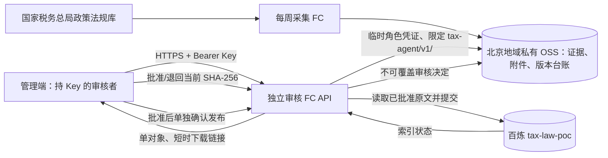

# 税务资料前端审核区设计与实施记录

## 目标与现状

在现有税务知识问答管理端增加“待审核入库”分区，让持现有百炼 Key 的使用者直接查看每周采集结果、阅读或下载原文与附件、批准或退回当前版本，并在批准后另行决定是否发布到 `tax-law-poc`。第一期沿用国家税务总局政策法规库的官方来源、中国大陆人民币基金募投管退等既定范围，不扩展采集来源。

截至 2026-09-24，周采集器已将 7 份待审核资料存入北京地域私有 OSS，正式百炼知识库尚未新增这 7 份资料。审核区前端和独立审核 FC 已按本文实现；云端只读清单、详情、短时签名下载及预检已实际核对。批准、退回与发布路径已有自动化测试，尚未替用户对真实法规作审核决定或正式发布。

## 页面结构

在管理端左侧导航“知识库管理”旁新增“待审核入库”入口。它打开与现有视觉风格一致的宽屏管理视图，采用蓝灰纸面、深青绿主色和中文衬线标题。访客问答页面不出现该入口。窄屏时清单和详情顺序显示，操作按钮固定在详情底部；桌面端采用清单与详情双栏。进入页面前要求已填入 Key，待审数量只在打开分区时读取，避免问答页面持续请求。

```text
税务案头 / 待审核入库                         最近采集：2026-09-24 09:00  ·  完整
待审核 7    已批准待发布 0    发布处理中 0    处理记录
──────────────────────────────────────────────────────────────────────
搜索标题 / 文号         状态 ▾    优先级 ▾    来源类型 ▾     刷新
┌──────────────────────────┬───────────────────────────────────────────┐
│ 待审核清单                │ 国家税务总局……                         │
│ ● 高  标题……             │ 文号 · 发文单位 · 成文日期 · 政策原文     │
│    新发现 · 2026-09-24    │ 版本：首次发现 / 来源变更 / 提取器升级  │
│ ● 中  标题……             │ 来源官网  ↗    SHA-256：完整值［复制］  │
│    官方解读 · 2 个附件   │ 审核卡片 / 正文预览 / 附件（可下载）     │
│                          │ 效力和适用期间：须人工核验              │
│                          │ [下载原文] [下载附件]                    │
│                          │ [退回] [审核通过]                        │
└──────────────────────────┴───────────────────────────────────────────┘
```

清单默认显示“待审核”，按相关性、成文日期和发现时间排序。每行显示标题、文号、官方原文/官方解读、版本原因、附件数、发现时间及状态；详情才显示完整 SHA-256、原文链接、发文单位、官方列表标注、正文预览和版本差异。官方解读始终标作“解读，非政策原文”，不与法规合并。顶部显示采集运行状态；若某栏目失败或达到检查上限，应提示“本次采集不完整”，不能显示“本周无变化”。

正文预览取归档的 `source.txt`，以纯文本呈现，不执行归档 HTML。审核卡片显示现有 `review.md` 中的差异线索，提醒审核者仍需核对官方原文与关联文件。下载项包括原始网页快照、正文、审核卡片及逐个附件，显示文件名、大小和校验值。下载以浏览器保存为主；本地副本不改变私有 OSS 中的原件或台账。

## 审核与发布交互

1. **审核通过**：详情页要求填写审核人、适用起始日、原文/效力/适用期间核验依据，并勾选“已核对官方原文”；施行日如已核实则填写，否则留空并在依据中说明。提交时携带当前完整 SHA-256，服务端再次校验证据、版本和字段，再写不可覆盖的审核决定。共享 Key 只能证明操作者持 Key，审核人需手填，暂不能作为严格的个人身份认证。
2. **退回**：要求审核人和具体原因，绑定同一版本哈希并留痕。可用于范围不符、来源疑问、失效或材料质量问题；退回不会删除 OSS 证据。尚未决定时直接关闭详情，维持“待审核”。
3. **批准后发布**：批准状态显示在“已批准待发布”列表，不自动调用百炼。点击“发布到知识库”先运行只读预检，列出阻断原因，再显示目标知识库、文件名、官方来源和版本哈希。确认后由服务端读取私有 OSS 原文并调用百炼；网页浏览器不必先下载、再手动上传。含未转为可检索正文的附件、旧版已在正式库而未制定版本切换方案、哈希变化或资料不完整时，发布按钮禁用并解释原因。
4. **入库进度**：依次显示“准备发布”“提交中”“解析入库中”“索引完成，待问答抽验”或“需对账/索引失败”。百炼接受上传不等于可检索；索引完成后仍提示做网页和微信的代表性问答抽验。状态不确定时不可再次点击发布，须先查百炼和 OSS 台账，避免重复上传。

页面发生并发修改时返回“当前版本已变化或已有审核决定，请刷新”，保留表单草稿供审核者核对后重提。重复点击只触发一次操作；关键动作显示操作中的状态。退回与发布均提供明确的结果和错误信息，不将失败吞掉。

## 文件与权限链路



GitHub Pages 静态页面只持有浏览器中的现有百炼 Key，不内置 OSS AccessKey、角色凭证或私有 bucket 直读权限。新增独立审核 FC API，不在现有上传代理里混入 OSS 审核操作。API 以服务端保存的 Key 摘要校验请求，限制允许的管理端 Origin，校验每个资料 ID、完整哈希和可下载文件名，并设置 `no-store`。CORS 只限制浏览器来源，真正授权来自服务端 Key 校验。下载优先由 API 签发仅对应单个私有对象、短时有效且强制附件下载的 URL；页面不缓存 URL，也不直接渲染 HTML。官方来源链接另开页面，并去除 referrer。

实际接口使用同一个 HTTPS `POST /` 入口，以 JSON `operation` 区分动作。请求均须带 Bearer Key 和允许的管理端 Origin：

| `operation` | 用途 | 关键约束 |
| --- | --- | --- |
| `list` | 分页、筛选列表及最近采集状态 | 从 OSS 当前台账叠加审核与发布状态读取，不能仅使用可能过期的 `reports/latest.json` |
| `detail` | 详情、正文预览、审核卡片、附件清单 | 只返回当前版本的白名单字段；正文预览设大小上限 |
| `download` | 获取短时单文件下载 URL | 请求含完整哈希与固定文件标识；服务端映射 OSS 对象路径 |
| `decide` | 批准或退回 | 复用 `decideVersion` 与 OSS 不可覆盖决定；哈希冲突返回 409 |
| `plan` | 只读发布预检 | 复用现有证据、附件及旧版检查；返回具体阻断原因 |
| `publish` | 提交已批准版本 | 先写不可覆盖发布声明；超时或结果不明转“需对账” |
| `check` | 查询索引进度 | 复用 `checkPublished`；索引完成仅标“待问答抽验” |

发布 API 在本次 HTTPS 请求中使用操作者提交的百炼 Key 调用百炼，服务端不持久保存明文 Key。现有周采集 FC 继续只读官方来源并写私有 OSS，不增加公开触发器；审核 FC 使用单独 HTTP 触发器和项目限定 OSS 角色。发布声明和进度保存在独立的 `publications/<资料ID>/<SHA-256>/` 对象中，读取台账时叠加，避免周采集器保存旧台账覆盖发布状态。

## 分期与验收

**第一步：只读审核区。** 列表、详情、纯文本预览、官方来源跳转及私有文件下载已实现；已在真实 7 份待审资料上核对清单，并抽查详情与私有文件下载。

**第二步：审核决定。** 批准、退回、冲突提示和留痕已接通并通过自动化测试。错误 Key 的云端请求已验证返回 401；真实材料的首次人工审核及下一次周采集后的状态一致性仍待实际发生后验收。

**第三步：发布与验收。** 预检和独立发布操作已接通；云端只读预检确认未审核材料被阻断。真实发布需待人工批准一份无附件、无旧版冲突的资料后，核对百炼文件、索引状态并做代表性问答抽验。附件解析和旧版索引切换另列实施项，未完成时保留发布阻断。

首期按需分页、按需生成下载链接，审核 FC 不设常驻实例；费用主要是少量 FC 请求、OSS 请求及实际下载流量，正式发布才发生百炼解析与向量化费用。

## 已确认的交互选择

- 审核通过后，另点发布入库，与当前命令行流程一致。
- 网页纯文本预览，并允许下载原文和附件；完整法规与附件仍以下载后核对官方来源为准。

权限范围：所有持现有百炼 Key 的人均可批准或退回。
