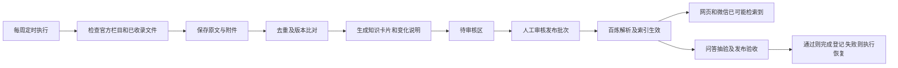

# 税务知识自动更新 Agent 方案

版本：v0.2｜日期：2026-09-24｜状态：首期采集已部署，审核与发布链路继续开发。

本文保留最初的阶段目标和设计取舍；下文描述的未实施事项仍按验收要求追踪。2026-09-24 已部署国家税务总局四个栏目周采集、私有 OSS 证据档案与待审核台账，云端连续试跑成功；正式百炼知识库仍为原来的 1 份文件。其余来源、审核管理页、模型整理与受控发布验收尚在后续阶段。

## 1. 已确认的目标与建议

建设一个每周执行的税务资料更新 Agent：发现与一级股权投资相关的资料，保存原文，整理知识卡片，识别规则变化，提交审核，通过后加入项目现有知识库。

用户已确认：

- 业务范围：中国大陆人民币基金募投管退、合伙企业及个人／机构投资者税务。
- 发布方式：先自动整理到待审核区，审核后入库；试运行稳定后再扩大自动入库范围。
- 运行节奏：每周一次，尽量降低新增运行费用。

建议第一期采用“固定来源采集 + 模型整理 + 人工审核 + 可追溯发布”的流程。程序负责抓取、去重、记录版本和上传；模型负责相关性判断、材料整理及变化解释。把法律效力判断、存疑信息和正式发布留给审核环节。

暂定每周一北京时间 09:00 启动，可在实施配置中修改。新增资料发布须经审核，所以“每周采集完成”与“正式知识库更新完成”是两个不同状态。

## 2. 当前项目可以复用什么

| 项目现状 | 对方案的影响 |
| --- | --- |
| 项目使用百炼知识库 `tax-law-poc`，ID 为 `uwohowhkia` | 继续作为正式问答知识库，无须立即更换底座 |
| 网页管理端和微信访客端共用知识问答应用及知识库 | 一次正式发布会影响两个入口，审核区须独立于公开检索范围 |
| 已有上传、登记、解析、入库、状态检查和移除索引流程 | 可以复用协议与状态处理，新增适合服务端执行的客户端 |
| 已有上传代理和微信问答两个 FC 函数 | 采集任务使用独立函数，避免采集耗时影响聊天 |
| 当前上传客户端含浏览器文件对象、XHR、前端代理依赖 | 不能把前端模块直接放到定时任务中运行，需抽取通用逻辑 |
| 仓库中未见采集调度、来源台账、规则版本或审核后台 | 这些是本次需要建设的部分 |
| 当前问答请求没有按交易日期或法规状态设置检索过滤 | 第一阶段不能承诺自动回答任意历史时点的适用规则 |

这里的“数据库”分两部分：百炼知识库负责问答检索；新增资料台账负责来源、效力状态、版本关系、审核和发布记录。仅将文件堆入知识库，难以可靠跟踪规则变化。

## 3. 采集范围与资料优先级

### 3.1 按投资场景组织知识

| 场景 | 优先主题 |
| --- | --- |
| 募集与设立 | 公司制／合伙制基金、GP／LP、个人和机构投资者、出资形式及相关税务处理 |
| 投资 | 增资、老股转让、非货币性资产投资、可转股安排、股权计税基础 |
| 持有与分配 | 股息红利、合伙企业所得分配、先分后税、管理费、业绩报酬及其适用条件 |
| 退出 | 股权转让、回购、减资、清算、上市后退出涉及的所得税和其他相关税种 |
| 重组 | 股权收购、合并分立、划转、特殊性税务处理及递延条件 |
| 优惠与征管 | 创投优惠、备案与留存资料、申报扣缴、关联交易和股权转让价格核定 |

税种按事项关联企业所得税、个人所得税、增值税及附加、印花税等；涉及不动产或资产交易时才扩展其他税种。第一期不建立跨境架构或香港税法专题库。

检索采用“业务词 + 税务词 + 主体词”的组合，同时保留上位法、实施规定、征管规则和废止目录等基础来源。不能仅筛选标题里含“股权投资”的文件，否则会遗漏影响整个投资链条的通用规则。

### 3.2 来源清单

下表是拟接入的来源目录，入口域名用于定位官方站点；具体栏目、分页、附件、抓取许可及可达性须在实施时逐一验证。

| 来源 | 用途 | 入库定位 |
| --- | --- | --- |
| 国家法律法规数据库（`flk.npc.gov.cn`） | 法律法规、修订与效力线索 | 权威原文；具体效力层级按文件本身记录 |
| 中国政府网（`gov.cn`） | 国务院文件、政策发布与废止清理 | 按文件类型分类，转载须关联原发布机关 |
| 财政部（`mof.gov.cn`） | 税收政策、公告及附件 | 重点原始来源 |
| 国家税务总局（`chinatax.gov.cn`） | 政策法规、公告、解读、办税口径 | 原文与解读分别标注 |
| 省市税务局及财政部门官方站点 | 地方执行口径和适用区域 | 必须标注地区及发布机关，不能推广为全国规则 |
| 证监会、中基协（`csrc.gov.cn`、`amac.org.cn`） | 基金及创投政策背景、资格条件 | 监管／自律资料，不能视作税法本身 |

第一期以全国性规则为主，控制在约 6–10 个核心栏目。地方来源在确认基金注册地、管理人所在地及重点投资地区后扩充，避免低相关信息挤占审核和模型预算。

资料分为四类：法规政策原文、官方解释／答复、案例材料、专业机构观点。网站官方身份不等于页面内容具有规范性文件效力；征求意见稿、新闻、政策解读和问答都必须单独标注。

律所、会计师事务所等文章用于发现议题和补充理解，第一期默认不批量采集全文。若后续纳入，记录作者、日期、授权及引用范围，并追溯所引官方依据。公众号和裁判文书的大规模采集放到后续阶段。

## 4. 每周自动运行的流程



1. **发现。** 优先检查官方栏目、公开接口及订阅源。采集时回看最近 30 天，并沿用上次成功处理位置，覆盖延迟发布或补录。首次建立基础库和定期全面复查单独安排。
2. **保存。** 取得正文和关联附件，保存不可变的原始快照、来源链接、抓取时间和校验值。仅有搜索摘要的候选不能进入正式发布流程。
3. **去重。** 按“发布机关 + 文号 + 文件身份”识别同一法规，用正文校验值区分版本；没有文号时结合规范化标题、发布日期、来源人工校验。跨站转载合并为一个文件身份，但保留多个出处。
4. **相关性判断。** 先用主题规则筛选，模型只处理新增或实质变化的内容。关键上位法、废止清理和有效期事项优先处理；低相关候选保留排除理由，定期抽样检查漏报。
5. **整理。** 提取主体、税种、业务环节、时间条件和原文依据，生成知识卡片与版本差异。无法核实的字段留空并标记待核验，不由模型补齐。
6. **校验。** 检查正文完整性、附件齐全性、引文位置、数值和日期一致性；扫描件或表格出现低质量提取时进入人工队列。
7. **审核。** 用户看到原文、整理稿、变化证据及拟发布文件清单，可批准、退回或忽略。审核绑定具体内容校验值；批准后若原文变化，必须重新审核。
8. **发布。** 通过服务端接口上传已批准的材料、登记文件并创建入库任务；逐文件确认解析和索引成功，再做代表性问题抽验。
9. **汇总。** 输出新增、修订、疑似失效、待审核、已发布、失败及未完成来源。来源抓取失败必须显示“未完成检查”，不能写成“本周无变化”。

周报默认保存在管理端，包含原文链接和审核入口。邮件、企业微信、公众号推送等外部消息渠道不在第一期默认启用。

## 5. 每份材料的整理成果

每份正式材料形成一个相互关联的资料包，原文是事实依据，知识卡片帮助检索，变化记录负责追踪。

| 成果 | 内容 | 存放位置 |
| --- | --- | --- |
| 原始快照 | 原始网页、原文件及附件，抓取时间与校验值 | 私有对象存储的证据档案 |
| 原文整理版 | 保留条款顺序和原文内容，只清理导航、广告等非正文；附来源与文档类型 | 审核后进入百炼，可关联原文件 |
| 知识卡片 | 适用主体、交易环节、核心规则、条件与例外、关键日期、依据、待核验事项 | 审核后进入百炼，明确标注“整理内容” |
| 变化记录 | 旧条款、新条款、变化类型、起算日期、受影响场景和证据 | 台账及审核面板；发布时选取必要说明 |
| 周报 | 本周覆盖情况、变化摘要、审核待办、失败与费用用量 | 私有管理区 |

知识卡片模板：

```text
标题／文号／发布机关
资料类型：法规政策原文、官方解读、问答、案例或专业观点
主题：募／投／管／退；主体：基金、GP、LP、个人、企业等
发布日／施行日／适用交易或税款所属期间／失效或届满日
效力状态及核验依据；适用地域
核心规则：每项说明对应原文条款或页码
适用条件、例外、申报或留存要求
与既有规则的关系：新增、修改、延续、部分废止、替代或尚不明确
实务影响：明确区分原文事实与整理者分析
官方来源及附件；最近核验时间；审核人和审核时间
```

保留条款和上下文，例外条款不得与一般规则脱离。原文、整理卡片和同一文件的多个附件共享一个资料身份，避免被误认为多个独立依据。文号、来源、效力和地域需要出现在实际可检索正文中；自定义元数据的写入与过滤能力另行验证，不能只写进文件名。

## 6. 如何识别规则变化

变化识别同时比较同一网页的新旧正文，以及新文件对旧文件的修改、废止、延续和解释关系。

| 变化情形 | 系统处理 |
| --- | --- |
| 导航、排版、浏览量或抓取时间变化 | 记录技术变化，不作为税务规则变更发布 |
| 同一文件正文或附件修改 | 保存新快照，展示段落或条款差异，待审核 |
| 新文件修改／替代旧文件 | 建立文件与具体条款的关联，记录变更依据 |
| 仅部分条款废止 | 标注受影响条款，保留仍有效部分，不能整份判为失效 |
| 优惠期限届满或临近届满 | 进入到期复核清单，核查延期、后续文件和过渡条款 |
| 公布但尚未施行 | 标为未来规则；默认不进入现行问答材料，安排生效复核 |
| 征求意见稿转为正式文件 | 建立对应关系，重新核对内容，不能把原草案直接升级为现行 |
| 地方解释与全国规则或其他地方口径不一致 | 显示地域、文件性质和冲突证据，交人工处理 |
| 页面消失、链接失效或检索不到 | 标记来源异常，不据此认定法规失效 |

发布日期、施行日期、交易发生日、税款所属期间及系统发现时间分别记录。效力状态必须有依据；“最近一次没有发现废止文件”不能等同于已经证明持续有效。未知效力不能默认归为现行。

定期任务除检查新发布内容，还轮换复核已收录的关键文件、废止清理目录和即将到期事项。每四次周任务完成一次基础文件复核循环；超过处理配额时记录未完成部分和最近核验日。

## 7. 审核、发布与旧版本管理

### 7.1 审核区与正式库

待审核区放在私有存储中，并由管理接口读取。第一期不另建一个始终运行的百炼待审核知识库，以减少常驻规格费用和资料误召回。

管理员复用现有管理端连接方式登录审核功能；服务端验证权限。审核文件和周报不放在公开 GitHub Pages 目录。当前微信公众号访客无法进入审核区。

审核面板至少包含：官方原文链接、整理卡片、变更差异、适用时间与地域、无法确认的字段，以及本批次计划新增／替换／移出当前检索范围的文件。

首期由用户审核；将来如增加团队审核，再建立独立账户及角色。现有共享 Key 只能证明管理权限，不能提供严格的个人身份归责。

### 7.2 正式发布的操作顺序

1. 固定获批内容和发布清单，保存发布前知识库文件映射。
2. 登记原文件并保存 `fileId`；创建入库任务并保存 `jobId`，全程留有可恢复状态。
3. 确认每份文件的解析与索引状态，验证资料数量与实际可检索内容。
4. 用代表问题检查文号、关键条件、施行时间与来源引用；异常时标记本批发布未完成。
5. 涉及旧索引调整时，只执行本批次明确批准的文件操作，再复查新旧版本召回情况，记录结果。

**真实对外生效点是索引变得可检索，可能早于问答抽验完成。** 本方案的“发布成功”表示验收完成，并不是百炼提供了一个验收后才开放检索的开关。第一期直接写入共用库时，获批的新材料在检查期间就可能影响两个入口的回答。

“上传请求成功”“文件已登记”“索引完成”“抽验通过”分别记录。新版本只有通过这些检查才记为发布成功。登记成功但后续失败时按已保存 ID 续传流程，避免重复上传；如果服务器已登记但响应丢失，先对账，无法确认则人工处理，不盲目重试。

每个发布批次同时提交恢复清单供审核：抽验失败时停止后续操作，仅移出本批新增的异常索引；如已调整旧索引，按发布前映射恢复仍适用且获批的材料。源文件和全部操作证据保留。已核实失效的旧规则不能为了恢复资料数量而重新当作现行规则发布。恢复后核对索引清单及代表性检索结果，直到异常材料不再被召回；同步未完成时状态持续显示“恢复中”，不能标为成功。

### 7.3 旧规则与历史查询

永久保留原始快照和版本记录。对于现行检索材料，整体失效、部分失效和被替代要分别处理。整理出的现行条款视图明确标注“经审核整理”，列明原文及修订依据；不冒充官方公布的合并文本。

第一期不默认把全部历史原文、草案和未来规则加入当前共用知识库。原始证据档案保存它们，审核区可查阅。部分修订文件仅替换受影响的检索材料，不能删掉仍有效的其他条款。

当前百炼入库与索引移除是分步异步操作，现有项目没有原子版本切换机制。替换期间可能短暂同时召回新旧内容；正式批次要展示这种影响，并在管理端标注正在更新。首期低成本方案的建议取舍是：在约定发布窗口中执行已审核批次，允许这段可见的更新与恢复过程。若要求检查期间也不能影响访客，则必须在首次正式替换前实现隔离验证及受控切换，或经验证的后端版本过滤，而不能等扩大自动入库时再处理。

第一期支持“看到规则如何变化”和“核对当前收录依据”，不承诺严谨的任意历史时点问答。用户询问旧交易时，应提示需要核查当时适用版本；交易日期过滤与历史知识库路由作为后续明确功能建设，不能仅靠提示词保证。

新规则导致旧回答过期时，已有浏览器聊天记录也不会自动改写。后续应将知识库版本写入新回答记录，并在继续旧会话时提示重新核对依据；这一点须在试运行中验证。

## 8. 技术落地与费用控制

推荐组成：独立的云端 FC 定时任务、私有 OSS 档案与台账、现有百炼知识库、新增管理端审核入口。每周在云端运行，不依赖个人电脑开机。

| 组件 | 首期实现建议 |
| --- | --- |
| 来源配置 | 仓库保存来源及主题配置，便于审阅变更；不包含密钥或私有文档 |
| 采集与整理 | Node.js 服务端任务，复用项目语言和协议；优先 HTTP 获取，少量站点需要时才使用浏览器或 OCR |
| 原文和版本档案 | 私有 OSS，对象按资料身份和内容校验值不可变保存 |
| 状态台账 | 小规模使用 OSS JSON 记录和索引，配合条件写入／乐观锁；通过验证后使用，不使用 FC 临时磁盘作唯一数据库 |
| 运行互斥 | 定时调用、手动补跑、审批发布通过同一持久租约锁协调；限制工作者并发，故障后可恢复 |
| 审核后台 | 独立管理 API 验证权限、读取候选、记录审核、提交发布；不扩大公开微信问答接口权限 |
| 百炼入库 | 服务端客户端直接调用管理接口；记录文件及任务 ID，不经过浏览器 CORS 上传代理 |
| 监控 | 每次任务生成运行清单与费用用量；来源失联、凭证失效、解析失败、积压可在管理页查看 |

程序自动重试采用有限次数和退避；单次任务设置时长、页面数和模型处理量限制。超出执行窗口则保存进度，在后续受控执行中继续。每次运行同时显示已覆盖与尚未覆盖来源。

初始限额建议：每周抓取上限 300 页、模型深度整理上限 20 份材料，基础库补录单独计量；连续出现积压后再调整。重大有效期事项优先处理，低优先项延期并显示原因。限额是运行配置建议，须用真实样本测量后调整。

费用优先通过固定栏目采集、正文去重、只处理新增内容、缓存已完成整理结果及限制 OCR 控制。第一期不依赖付费全网搜索，也不默认新增常驻关系型数据库。台账规模或多人并发增长后，再迁移托管数据库。

新增成本包括 FC、私有存储及请求流量、模型整理、文档解析／向量化、发布抽验，以及可能新增的百炼知识库规格费。现有对外问答费用单独统计。百炼知识库存在按规格和运行时长计费的部分，不能按“每周只运行一次”推断知识库费用也只产生一次。

建议先完成一次受控试跑，记录页面数、Token、解析页数和资源耗时，再推算月度增量。尚未读取账单或核对实际资源规格，本文不提供固定月费承诺。若需预算控制，可由用户设置月度预算，达到约定阈值后暂停新增付费处理；平台账单延迟及已有资源固定费用意味着程序阈值不等于云账号硬性封顶。

采集遵守站点公开访问规则与合理频率。抓取内容只作为资料输入，网页中的指令不能修改来源清单、调用凭证或决定发布动作。密钥只用于服务端受控调用，不写入文档、仓库或日志。

## 9. 分阶段交付与验收

以下是实施顺序，不是固定工期承诺。具体工期在来源可达性、现有文件盘点及接口验证后确定。

| 阶段 | 工作与交付 | 完成标准 |
| --- | --- | --- |
| A：接口与资料盘点 | 列出现有库文件和效力情况，验证来源、权限和发布接口；确认核心主题目录，提交存量基线处置清单 | 确定来源与业务覆盖矩阵；经审核处理失效、重复、未知效力及冲突材料，形成可追溯基线 |
| B：基础库与样稿 | 优先整理约 30–50 份核心依据，分批提交审核；产出 10 份代表性知识卡片、变化样例及一份周报 | 用户确认相关性、整理颗粒度与审核负担；未覆盖主题明确列出 |
| C：每周试运行 | 实现采集、档案、版本记录、审核面板与受控发布 | 连续约四周产生可审核结果；失败与未覆盖来源可见；重复运行不重复入库 |
| D：评估自动化范围 | 依据误报、漏报、引用质量和实际成本决定是否扩大自动入库 | 稳定来源的低风险新增材料可单独制定规则；重大修订、废止、冲突及不确定项继续审核 |

存量基线处置至少区分“核实后保留、更新整理、合并重复、移出当前检索、待核验隔离”五类。先归档再按获批清单调整；未知效力及未解决冲突的材料保存在私有档案和待办区，不继续作为已核实的现行依据供正式检索。原有概览文件如混合多个时期的规则，需要逐项处理，不能仅给整份文件加一个“现行”标签。基线验收核对正式索引、保留依据、历史档案和待核验清单，不以“盘点表已完成”代替实际处理。

上线验收至少包括：

- 每份获批材料都有可核查官方来源、原始快照、文档类型和审核记录。
- 关键引文能定位到原文；未知日期、效力和条件不被自动补写。
- 已知样例覆盖新增、部分废止、全文替代、延期、草案、附件更新和页面噪声。
- 同一批材料重复执行不产生重复正式索引；中断可按记录恢复。
- 同一发布批次只处理明确批准的资料身份和版本，不改变其他存量文件。
- 新规则的适用时间及条件在网页端、微信端代表性问答中均能核对。
- 不能取得原文、来源失联、索引失败和日期矛盾均进入可见异常列表。
- 用人工检查的来源清单评估漏报；以“多少已核实文件被发现”为指标，不仅统计抓取数量。
- 四周试运行后报告审核耗时、候选采用率、来源覆盖率、待办积压和实际增量费用。

这里列出的验收是实施要求，本次拟方案并未执行这些测试。

## 10. 尚需确定的事项

| 事项 | 当前建议／影响 |
| --- | --- |
| 地方政策重点地区 | 第一阶段先全国性规则；补充基金注册地、管理人所在地及主要投资地区后接入地方来源 |
| 历史规则需求 | 第一阶段保留历史档案与变化记录；如必须按任意交易日期自动给出适用规则，需增加检索与应用改造 |
| 发布期间的一致性要求 | 低成本建议允许已审核材料在索引更新与抽验期间逐步生效；若要求全部检查通过后才对外可见，首次正式替换前增加隔离与切换能力 |
| 周期与查看方式 | 暂定周一 09:00；管理页查看周报及审核，无外部自动消息发送 |
| 费用目标 | 用户已要求尽量低；真实样本试跑后给出增量测算，再确定是否设置具体月度预算 |

以上未定事项不影响审核首版方案。下一步实施可从来源清单、现有资料盘点和少量样稿开始，先验证材料是否真正有用，再接通每周采集与正式发布。

## 11. 方案依据与能力边界

项目依据：

- [README.md](README.md)：当前服务、上传入库能力、知识库固定目标及共同使用方式。
- [项目架构说明.md](项目架构说明.md)：网页与微信共用知识库，当前公开访客入口及后台边界。
- [lib/knowledge.js](lib/knowledge.js)：上传、登记、入库任务、状态判断和索引移除协议。
- [app.js](app.js)、[wechat/index.mjs](wechat/index.mjs)：当前问答请求参数及调用方式。

百炼技术参考来自本机 `bailian-docs-llm-wiki` 技能目录，属于文档参考，实施时仍需核对云端当前版本：

- `wiki/guides/knowledge-base.md`：知识库功能概览；涉及具体参数以原始文档和实际接口核验为准。
- `raw/application-api-reference/rag-api/rag-api-data-import/rag-api-add-file.md`：文件登记流程、标签与来源 URL 字段。
- `raw/application-api-reference/rag-api/knowledge/knowledgechat.md`：当前知识问答接口及参数。
- `raw/application-user-guide/knowledge-base/reference/billing-for-knowledge-base.md`：规格费、模型费用及计费起点。

本方案不把其他百炼智能体 API 的 `metadata_filter` 等参数直接套用到当前知识问答接口。历史过滤、来源展示、可检索元数据和批次切换均须在当前应用与知识库上验证。内容采集与整理也不意味着已完成税法效力认定；核验依据和未确认事项必须随材料保留。
