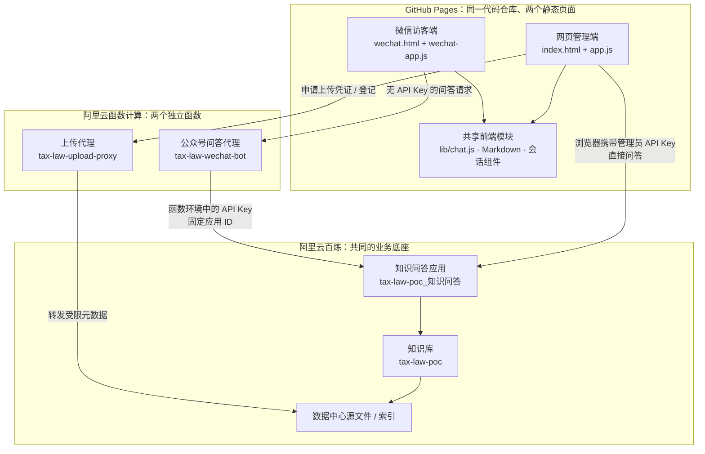

# 税务案头：网页端与微信端架构说明

> 适用范围：当前 GitHub Pages + 阿里云百炼 + 阿里云函数计算（FC）的 POC。本文说明“网页端”和“微信端”哪些能力共用、哪些独立；不包含 API Key、微信密钥或 AccessKey。

## 一句话结论

两个入口是 **两套前端页面、两条不同的调用链路**，但它们最终查询的是 **同一个百炼知识问答应用** `tax-law-poc_知识问答`，以及该应用关联的 **同一个知识库** `tax-law-poc`。

因此，在网页管理端上传或移除一份知识库文件，待百炼完成索引同步后，网页端和微信端的回答都会受到影响；但两个入口的聊天记录、访问凭证和可操作的功能并不共享。

## 全景关系

## 共用部分

### 1. 同一个百炼知识问答应用与知识库

| 共同资源 | 当前值 | 含义 |
| --- | --- | --- |
| 知识问答应用 | `tax-law-poc_知识问答` | 两端生成答案的共同服务 |
| 应用 ID | `aid-c13de479d8944f12b3c45ef9a45af154` | 两端调用的固定目标 |
| 知识库 | `tax-law-poc` | 两端共同检索的法规、资料和索引 |
| 知识库 ID | `uwohowhkia` | 文件管理对应的固定知识库 |
| 回答模型 | `qwen3.6-plus` | 应用配置的一部分；变更后会影响两端 |
| 向量化 / 重排序 | `text-embedding-v4` / `qwen3-rerank` | 知识库检索配置的一部分 |

结论：**知识库内容、应用提示词、回答模型、检索配置属于共同底座。** 在百炼控制台修改其中任何一项，通常都会同时改变两个入口的回答。

### 2. 共享的前端逻辑

| 文件 / 模块 | 两端如何使用 |
| --- | --- |
| `lib/chat.js` | 定义默认应用 ID、百炼问答接口地址、最近对话上下文的裁剪规则，以及流式响应解析规则。网页端直接使用；微信 FC 也导入同一模块。 |
| `lib/markdown.js` | 安全地将模型回答渲染为页面内容。 |
| `conversation-manager.js` | 两端都使用同一套“新建、切换、重命名、删除、导入、导出对话”的浏览器端会话管理界面逻辑。 |
| `lib/conversations.js` | 两端都使用 IndexedDB 保存多段本机对话、处理备份和并发修改。 |
| 上下文规则 | 两端都只带入最近最多 10 轮完整问答，总长度最多约 24,000 字符；这不是服务器长期记忆。 |

共享代码不代表共享数据：会话组件支持指定不同的存储命名空间，避免两个入口读到彼此的本地聊天记录。

## 网页管理端独有部分

入口为 <https://allenruan92.github.io/tax-law-chat/>。

| 能力 | 实现位置 | 为什么只在网页管理端提供 |
| --- | --- | --- |
| 填写、清除 API Key | `index.html`、`app.js` | 这是管理员操作；Key 仅保存在该浏览器标签页的 `sessionStorage`。 |
| 直接调用百炼问答接口 | `app.js` → 百炼 | 浏览器在请求中携带管理员 Key。 |
| 知识库文件列表 | `knowledge-manager.js`、`lib/knowledge.js` | 需要知识库管理权限。 |
| 上传、登记、解析入库 | `knowledge-manager.js`、上传代理 FC | 文件二进制由浏览器直传百炼 OSS；FC 仅代理申请上传凭证和登记元数据。 |
| 移除知识库中的文档索引与切片 | `knowledge-manager.js` | 会影响共同知识库，属于管理操作。数据中心源文件不会被此操作永久删除。 |
| 下载原始文件 | `knowledge-manager.js` | 从百炼为管理员临时签发的原文件地址下载。 |
| 上传代理 | `fc/code/index.js`、`fc/` | 独立函数 `tax-law-upload-proxy`；校验调用方提供的 Key 摘要，只服务文件上传/登记。 |

网页管理端的默认本地会话命名空间是 `tax-law-chat`。它的聊天记录不会同步给微信访客端，也不会同步到其他浏览器或设备。

## 微信访客端独有部分

入口为 <https://allenruan92.github.io/tax-law-chat/wechat.html>。该页面可通过公众号菜单发送的文字链接打开，也可在普通浏览器打开。

| 能力 | 实现位置 | 说明 |
| --- | --- | --- |
| 访客聊天页面 | `wechat.html`、`wechat-app.js`、`wechat.css` | 仅保留连续问答与本机多会话，不显示连接设置或知识库管理。 |
| 无 Key 的前端请求 | `wechat-app.js`、`wechat-config.js` | 浏览器只请求固定 FC 问答地址，不持有百炼 API Key。 |
| 后端代为调用百炼 | `wechat/index.mjs` | 独立函数 `tax-law-wechat-bot` 从环境变量读取 Key，并锁定调用共同的应用 ID。 |
| 公开 POC 模式 | `wechat/index.mjs` 的 `PUBLIC_CHAT=true` | 当前固定链接无需登录、体验码或临时令牌；任何拿到链接的人都能提问。 |
| 微信回调兼容逻辑 | `wechat/index.mjs`、`wechat/crypto.mjs` | 用于微信验签和加密回调；当前菜单采用“发送消息 → 文字”发送固定链接，不依赖回调才能聊天。 |
| 微信历史命名空间选择 | `lib/wechat-entry.js` | 默认使用 `tax-law-wechat.guest`，并兼容旧版专属链接产生的本机历史分区。 |

微信端没有上传、删除、下载、文件列表或修改应用配置的接口。即使访客查看浏览器开发者工具，也无法从静态页面取得百炼 API Key。

## 两端的关键差异

| 维度 | 网页管理端 | 微信访客端 |
| --- | --- | --- |
| 用户定位 | 管理员 / 内部测试 | 公众号读者 / 外部访客 |
| 页面 | `index.html` | `wechat.html` |
| 问答链路 | 浏览器 → 百炼 | 浏览器 → 问答 FC → 百炼 |
| API Key 所在位置 | 管理员浏览器当前标签页 | 仅 FC 环境变量，访客浏览器没有 Key |
| 知识库管理 | 可列出、上传、入库、移除、下载 | 不提供 |
| 文件管理链路 | 浏览器 → 上传代理 FC → 百炼 / OSS | 无 |
| 本地对话库 | `tax-law-chat.*` | `tax-law-wechat.*` |
| 是否可公开使用 | 页面可打开，但问答/管理需 Key | 当前公开 POC，链接可直接问答 |
| 费用承担 | Key 所属百炼账号及相关 FC 资源 | 同一阿里云账号；访客不承担费用 |

## 变更影响速查

| 如果修改…… | 需要更新 / 影响…… |
| --- | --- |
| 知识库文件、检索设置、应用提示词或回答模型 | **网页端和微信端都会变**。修改在百炼侧生效，不需要改两个页面。 |
| `lib/chat.js` 中的应用 ID、接口地址或响应解析 | **两端都会受影响**；网页静态页需发布到 GitHub Pages，微信 FC 也需重新打包部署。 |
| `index.html`、`app.js`、`styles.css`、`knowledge-manager.js` | 仅网页管理端。 |
| `wechat.html`、`wechat-app.js`、`wechat.css`、`wechat-config.js` | 仅微信访客端静态界面。 |
| `wechat/index.mjs` 或其 FC 环境变量 | 仅微信访客端后端链路；需要重新部署问答 FC。 |
| `fc/code/index.js` 或上传代理环境变量 | 仅网页管理端的上传/登记功能；需要重新部署上传代理 FC。 |
| 本机浏览器缓存 / IndexedDB | 只影响当前浏览器当前入口的历史，不改变云端知识库或其他人的历史。 |

## 数据与权限边界

1. **知识库是共同资产。** 管理端移除文档索引后，微信端也无法再检索该文档；新文件完成解析并显示“可检索”后，两端都可能用到它。
2. **聊天记录不是共同资产。** 网页端和微信端各自将对话保存在访问者自己的浏览器 IndexedDB 中，服务器不建立共享会话数据库。
3. **Key 的暴露面不同。** 网页管理端是“持 Key 使用”；微信端是“由后端持 Key、访客匿名使用”。
4. **微信端当前是公开入口。** 公开不等于仅公众号粉丝可用；任何知道链接的人都可以访问，并可从共同知识库中提问。因此不应把仅限内部的敏感资料放入该知识库。
5. **当前未配置联网搜索。** 两端当前都只调用共同的知识问答应用；即使所用模型支持联网能力，也不会因为更换页面而自动联网。

## 发布与运维提示

- 静态网页：GitHub 仓库 `main` 分支根目录发布到 GitHub Pages；网页端和微信端静态页面一起更新。
- 微信问答后端：通过 `wechat/deploy.mjs` 打包并部署到独立 FC。修改 `wechat/index.mjs` 或引入的 `lib/chat.js` 后，需要单独部署。
- 网页上传代理：通过 `scripts/package-fc.ps1` 打包并部署到独立 FC。它与微信问答函数互不覆盖。
- 百炼应用 / 知识库：在百炼控制台或经过授权的管理接口中维护。其配置是两个入口共同依赖的云端状态。

## 相关文件索引

| 主题 | 主要文件 |
| --- | --- |
| 网页管理端 | `index.html`、`app.js`、`styles.css` |
| 微信访客端 | `wechat.html`、`wechat-app.js`、`wechat.css`、`wechat-config.js` |
| 公共聊天与会话 | `lib/chat.js`、`lib/markdown.js`、`conversation-manager.js`、`lib/conversations.js` |
| 微信专用历史与后端 | `lib/wechat-entry.js`、`wechat/index.mjs`、`wechat/crypto.mjs` |
| 网页知识库管理 | `knowledge-manager.js`、`lib/knowledge.js`、`lib/config.js` |
| 网页上传代理 FC | `fc/code/index.js`、`fc/README.md` |
| 微信问答 FC | `wechat/deploy.mjs`、`wechat/smoke.mjs`、`wechat/README.md` |

---

维护建议：每次新增入口、修改知识库权限、切换模型或引入联网搜索时，都应先更新本文的“全景关系”“变更影响速查”和“数据与权限边界”三节。
